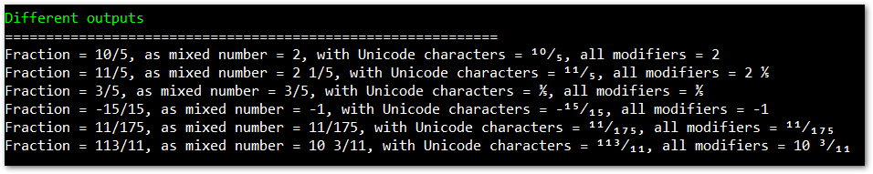

# MathExtended.Fractions
Pure C# Fractions Library.

## Legal information and credits

MathExtended.Fractions is project by Ales Hotko and was first released in May 2020. It's licensed under the MIT license.

## Usage

### Creation

```csharp
//fraction can be created with numerator and denominator as parameters:
Fraction fraction = new Fraction(2, 5);
Console.WriteLine($"Fraction = {fraction.ToString()}");
//Output:
//Fraction = 2/5

//...or only by numerator part (in this case denominator is 1):
Fraction fraction = new Fraction(2);
Console.WriteLine($"Fraction = {fraction.ToString()}");
//Output:
//Fraction = 2/1

//...or from string in format "numerator/denominator":
Fraction fraction = new Fraction("1/5");
Console.WriteLine($"Fraction = {fraction.ToString()}");
//Output:
//Fraction = 1/5

//...or from decimal value with accuracy:
Fraction fraction = new Fraction(0.3333, 0.01);
Console.WriteLine($"Fraction = {fraction.ToString()}");
//Output:
//Fraction = 1/3

//...or from decimal value with default accuracy:
Fraction fraction = new Fraction(0.3333);
Console.WriteLine($"Fraction = {fraction.ToString()}");
//Output:
//Fraction = 3333/10000
```

### Assigning the value

Value can be initially assigned at creation, as seen in [previous section](#creation).
If value needs to be assigned afterwards afterwards, there are several possible ways.

```csharp
//...or by using numerator and denominator properties:
fraction.Numerator = 3;
fraction.Denominator = 7;
Console.WriteLine($"Fraction = {fraction.ToString()}");
//Output:
//Fraction = 3/7

//...or by using .AsDouble property:
fraction.AsDouble = 0.5;
Console.WriteLine($"Fraction = {fraction.ToString()}, AsDouble = {fraction.AsDouble}");
//Output:
//Fraction = 1/2, AsDouble = 0.5

//...or by using .AsFloat property:
fraction.AsFloat = 0.5f;
Console.WriteLine($"Fraction = {fraction.ToString()}, AsFloat = {fraction.AsFloat}");
//Output:
//Fraction = 1/2, AsFloat = 0.5
```

### Available Mathematical Operations

#### Addition

```csharp
//addition of two fractions
var fractionOne = new Fraction(1, 5);
var fractionTwo = new Fraction(2, 5);
var result = fractionOne + fractionTwo;
Console.WriteLine($"Fraction = {result.ToString()}, reduced fraction = {result.Reduced().ToString()}");
//Output:
//Fraction = 15/25, reduced fraction = 3/5

//addition of fraction and number
result = fractionOne + 3;
Console.WriteLine($"Fraction = {result.ToString()}, reduced fraction = {result.Reduced().ToString()}");
//Output:
//Fraction = 16/5, reduced fraction = 16/5

//addition of fraction and a decimal number
result = fractionOne + 0.5;
Console.WriteLine($"Fraction = {result.ToString()}, reduced fraction = {result.Reduced().ToString()}");
//Output:
//Fraction = 7/10, reduced fraction = 7/10
```

#### Subtraction

```csharp
//subtraction of two fractions
var fractionOne = new Fraction(1, 5);
var fractionTwo = new Fraction(2, 5);
var result = fractionOne - fractionTwo;
Console.WriteLine($"Fraction = {result.ToString()}, reduced fraction = {result.Reduced().ToString()}");
//Output:
//Fraction = -1/5, reduced fraction = -1/5

//subtraction of fraction and number
result = fractionOne - 3;
Console.WriteLine($"Fraction = {result.ToString()}, reduced fraction = {result.Reduced().ToString()}");
//Output:
//Fraction = -14/5, reduced fraction = -14/5

//subtraction of fraction and a decimal number
result = fractionOne - 0.5;
Console.WriteLine($"Fraction = {result.ToString()}, reduced fraction = {result.Reduced().ToString()}");
//Output:
//Fraction = -3/10, reduced fraction = -3/10
```

#### Multiplication

```csharp
//multiplication of two fractions
var fractionOne = new Fraction(1, 5);
var fractionTwo = new Fraction(2, 5);
var result = fractionOne * fractionTwo;
Console.WriteLine($"Fraction = {result.ToString()}, reduced fraction = {result.Reduced().ToString()}");
//Output:
//Fraction = 2/25, reduced fraction = 2/25

//multiplication of fraction and number
result = fractionOne * 3;
Console.WriteLine($"Fraction = {result.ToString()}, reduced fraction = {result.Reduced().ToString()}");
//Output:
//Fraction = 3/5, reduced fraction = 3/5

//multiplication of fraction and a decimal number
result = fractionOne * 0.5;
Console.WriteLine($"Fraction = {result.ToString()}, reduced fraction = {result.Reduced().ToString()}");
//Output:
//Fraction = 1/10, reduced fraction = 1/10
```

#### Division

```csharp
//division of two fractions
var fractionOne = new Fraction(1, 5);
var fractionTwo = new Fraction(2, 5);
var result = fractionOne / fractionTwo;
Console.WriteLine($"Fraction = {result.ToString()}, reduced fraction = {result.Reduced().ToString()}");
//Output:
//Fraction = 5/10, reduced fraction = 1/2

//division of fraction and number
result = fractionOne / 3;
Console.WriteLine($"Fraction = {result.ToString()}, reduced fraction = {result.Reduced().ToString()}");
//Output:
//Fraction = 1/15, reduced fraction = 1/15

//division of fraction and a decimal number
result = fractionOne / 0.5;
Console.WriteLine($"Fraction = {result.ToString()}, reduced fraction = {result.Reduced().ToString()}");
//Output:
//Fraction = 2/5, reduced fraction = 2/5
```

### Other operations

#### Reduce

```csharp
var fraction = new Fraction(3, 15);
Console.WriteLine($"Fraction = {fraction.ToString()}");
fraction.Reduce();
Console.WriteLine($"Fraction reduced = {fraction.ToString()}");
//Output:
//Fraction = 3/15
//Fraction reduced = 1/5
```

#### Inverse

```csharp
fraction = new Fraction(3, 15);
Console.WriteLine($"Fraction = {fraction.ToString()}");
fraction.Inverse();
Console.WriteLine($"Fraction inversed = {fraction.ToString()}");
fraction.Reduce();
Console.WriteLine($"Fraction inversed and reduced = {fraction.ToString()}");
//Output:
//Fraction = 3/15
//Fraction inversed = 15/3
//Fraction inversed and reduced = 5/1
```

### Continued Fractions

Also support for continued fractions is added. Continued fraction can be assigned at fraction creation
or assigned at runtime.

```csharp
//...
public static class ContinuedFractions
{
    public static readonly string e = "[2;1,2,1,1,4,1,1,6,1,1,8,1,1,10,1,1,12,1,1,14,1,1,16,1,1,18,1,1,20,1,1,22,1,1,24,1,1,26,1,1,28,1,1,30,1,1,32,1,1,34,1,1,36,1,1,38,1,1,40,1,1,42,1,1,44,1,1,46,1,1,48,1,1,50,1,1,52,1,1,54,1,1,56,1,1,58,1,1,60,1,1,62,1,1,64,1,1,66]";
    public static readonly string Pi = "[3;7,15,1,292,1,1,1,2,1,3,1,14,2,1,1,2,2,2,2,1,84,2,1,1,15,3,13,1,4,2,6,6,99,1,2,2,6,3,5,1,1,6,8,1,7,1,2,3,7,1,2,1,1,12,1,1,1,3,1,1,8,1,1,2,1,6,1,1,5,2,2,3,1,2,4,4,16,1,161,45,1,22,1,2,2,1,4,1,2,24,1,2,1,3,1,2,1]";
    public static readonly string Phi = "[1;1,1,1,1,1,1,1,1,1,1,1,1,1,1,1,1,1,1,1,1,1,1,1,1,1,1,1,1,1,1,1,1,1,1,1,1,1,1,1,1,1,1,1,1,1,1,1,1,1,1,1,1,1,1,1,1,1,1,1,1,1,1,1,1,1,1,1,1,1,1,1,1,1,1,1,1,1,1,1,1,1,1,1,1,1,1,1,1,1,1,1,1,1,1,1,1,1,1,1,1,1,1,1,1,1]";
    public static readonly string Sqrt2 = "[1;2,2,2,2,2,2,2,2,2,2,2,2,2,2,2,2,2,2,2,2,2,2,2,2,2,2,2,2,2,2,2,2,2,2,2,2,2,2,2,2,2,2,2,2,2,2,2,2,2,2,2,2,2,2,2,2,2,2,2,2,2,2,2,2,2,2,2,2,2,2,2,2,2,2,2,2,2,2,2,2,2,2,2,2,2,2,2,2,2,2,2,2,2,2,2,2,2,2,2,2,2,2,2,2,2]";
    public static readonly string Sqrt3 = "[1;1,2,1,2,1,2,1,2,1,2,1,2,1,2,1,2,1,2,1,2,1,2,1,2,1,2,1,2,1,2,1,2,1,2,1,2,1,2,1,2,1,2,1,2,1,2,1,2,1,2,1,2,1,2,1,2,1,2,1,2,1,2,1,2,1,2,1,2,1,2,1,2,1,2,1,2,1,2,1,2,1,2,1,2,1,2,1,2,1,2,1,2,1,2,1,2,1,2,1,2,1,2,1,2,1,2]";
}
//...

fraction = new Fraction(ContinuedFractions.e);
Console.WriteLine($"Fraction (e) = {fraction.ToString()}, AsDouble = {fraction.AsDouble}, AsContinuedFraction = {fraction.AsContinuedFraction}");
//Output:
//Fraction (e) = 1264/465, AsDouble = 2,71827956989247, AsContinuedFraction = [2;1,2,1,1,4,1,1,6]

fraction = new Fraction(ContinuedFractions.Pi);
Console.WriteLine($"Fraction (Pi) = {fraction.ToString()}, AsDouble = {fraction.AsDouble}, AsContinuedFraction = {fraction.AsContinuedFraction}");
//Output:
//Fraction (Pi) = 355/113, AsDouble = 3,14159292035398, AsContinuedFraction = [3;7,16]

fraction = new Fraction(Math.PI);
Console.WriteLine($"Fraction (Math.Pi) = {fraction.ToString()}, AsDouble = {fraction.AsDouble}, AsContinuedFraction = {fraction.AsContinuedFraction}");
//Output:
//Fraction (Math.Pi) = 355/113, AsDouble = 3,14159292035398, AsContinuedFraction = [3;7,16]

fraction = new Fraction(ContinuedFractions.Phi);
Console.WriteLine($"Fraction (Phi) = {fraction.ToString()}, AsDouble = {fraction.AsDouble}, AsContinuedFraction = {fraction.AsContinuedFraction}");
//Output:
//Fraction (Phi) = 377/233, AsDouble = 1,61802575107296, AsContinuedFraction = [1;1,1,1,1,1,1,1,1,1,1,2]

fraction = new Fraction(ContinuedFractions.Sqrt2);
Console.WriteLine($"Fraction (Sqrt2) = {fraction.ToString()}, AsDouble = {fraction.AsDouble}, AsContinuedFraction = {fraction.AsContinuedFraction}");
//Output:
//Fraction (Sqrt2) = 577/408, AsDouble = 1,41421568627451, AsContinuedFraction = [1;2,2,2,2,2,2,2]

fraction = new Fraction(ContinuedFractions.Sqrt3);
Console.WriteLine($"Fraction (Sqrt3) = {fraction.ToString()}, AsDouble = {fraction.AsDouble}, AsContinuedFraction = {fraction.AsContinuedFraction}");
//Output:
//Fraction (Sqrt3) = 362/209, AsDouble = 1,73205741626794, AsContinuedFraction = [1;1,2,1,2,1,2,1,3]

fraction = new Fraction("[2;1,4,3]");
Console.WriteLine($"Fraction (45/16) = {fraction.ToString()}, AsDouble = {fraction.AsDouble}, AsContinuedFraction = {fraction.AsContinuedFraction}");
//Output:
//Fraction (45/16) = 45/16, AsDouble = 2,8125, AsContinuedFraction = [2;1,4,3]
```

### Output

For output of resulting fraction method ```ToString()``` can be used, which results in a string,
representing the fraction.


```csharp
fraction = new Fraction(3, 15);
Console.WriteLine($"Fraction = {fraction.ToString()}");
//Output:
//Fraction = 3/15
```

#### Display Modifiers (Options)

Several modifiers can be used. They are sent to ```ToString()``` method as parameter.
Modifiers are in ```DisplayOptions``` enum, described below:

```csharp
[Flags]
public enum DisplayOptions
{
    /// <summary>Default display of fraction (e.g. 2/5 or 31/7)</summary>
    None = 0,
    /// <summary>Show improper fractions (e.g. 7/5) as mixed number (1 2/5)</summary>
    ImproperFractionAsMixedNumber = 1,
    /// <summary>Use unicode superscript and subscript set instead of standard ACSII set for numbers in fraction.</summary>
    UseUnicodeCharacters = 2
}

//...
private static void OutputFractionWithModifiers(Fraction fraction)
{
    var builder = new StringBuilder();
    builder.Append("Fraction = ").Append(fraction.ToString());
    builder.Append(", as mixed number = ").Append(fraction.ToString(Fraction.DisplayOptions.ImproperFractionAsMixedNumber));
    builder.Append(", with Unicode characters = ").Append(fraction.ToString(Fraction.DisplayOptions.UseUnicodeCharacters));
    builder.Append(", all modifiers = ").Append(fraction.ToString(Fraction.DisplayOptions.ImproperFractionAsMixedNumber | Fraction.DisplayOptions.UseUnicodeCharacters));
    Console.WriteLine(builder.ToString());
}
//...

//examples of different output options
fraction = new Fraction(10, 5);
OutputFractionWithModifiers(fraction);
fraction = new Fraction(11, 5);
OutputFractionWithModifiers(fraction);
fraction = new Fraction(3, 5);
OutputFractionWithModifiers(fraction);
fraction = new Fraction(15, -15);
OutputFractionWithModifiers(fraction);
fraction = new Fraction(11, 175);
OutputFractionWithModifiers(fraction);
fraction = new Fraction(113, 11);
OutputFractionWithModifiers(fraction);
//Output (in image):
```
